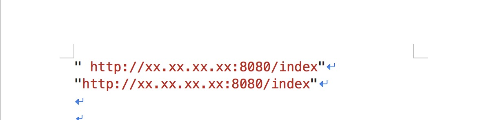

# summaryDailyWork
总结一下日常的工作中经常容易犯的错误，以及经验教训。

## 4.12 对需要登录显示的数据展示，一定要测试更换用户和退出登录
* 退出登录后，首页显示的数据竟然还是上个用户的数据
* 包括金额，文案，金钱的￥符号（&yen;）

## 6.29 在开发过程中，由于上线紧急，没有通过复制来更改文案，而自己手动打字，造成的后果不堪设想。
* "还款"写成了"付款"，"待还款"写成了"代还款"
* 在传参数时，除了一些基本的判空之外，还需要考虑传参的值是否可用，是否需要判断状态status等等
* 在进行很多页面高度或者宽度写死的情况，要注意多机型适配，基本上三种机型iPhone5s, iPhone6, iPhone7plus,iPhoneX
* 对于复制过来的代码需要反复测试，各种情况都需要测试到，最好自己先mock所有不同类型的数据

## 8.9 由一个空格导致的血案
* 数据库配置h5链接时，手误添加了一个空格
* 前端在请求后端接口的返回数据中，拿到了这个url, 肉眼可观是无空格的
* 尝试使用trim()方法过滤掉，无效。
* 将这个接口返回的url与我们正常浏览器访问的h5链接url，一起复制到word文档中，发现了区别
*  
